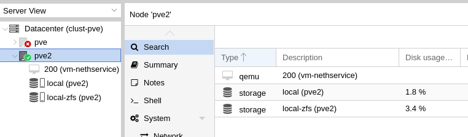

# Avvio della VM su PVE2

La replica sul secondo nodo avviene solo a livello storage, la [wiki di Proxmox](https://pve.proxmox.com/wiki/Storage_Replication#_error_handling), raccomanda la copia dei cfg della VM sul secondo nodo solo se si verificano problemi al primo, per evitare l'avvio della VM per sbaglio dal secondo nodo ( in caso si avviasse la macchina, ci sarebbe un incongruenza dei dati).

## Avviare la macchina solo ed esclusivamente ci fossero problemi con il primo nodo (PVE)


Grazie a corosync, i file di configurazione delle VM del primo nodo sono comunque accessibili, anche se l'host primario è offline.

Accediamo via SSH al secondo nodo (PVE2) e verifichiamo il funzionamento del cluster

```
root@pve2:~# hostname
pve2
root@pve2:~# pvecm status
Cluster information
-------------------
Name:             clust-pve
Config Version:   2
Transport:        knet
Secure auth:      on

Quorum information
------------------
Date:             Sun Apr  5 21:43:21 2020
Quorum provider:  corosync_votequorum
Nodes:            1
Node ID:          0x00000002
Ring ID:          2.12
Quorate:          No

Votequorum information
----------------------
Expected votes:   2
Highest expected: 2
Total votes:      1
Quorum:           2 Activity blocked
Flags:            

Membership information
----------------------
    Nodeid      Votes Name
0x00000002          1 192.168.5.94 (local)
```

Nell'esempio sopra riportato abbiamo simulato la perdita del primo nodo.

Forziamo il quorum sul secondo nodo per poter operare e avviare la macchina sullo stesso, da terminale diamo il comando ```pvecm expected 1```

```
root@pve2:~# pvecm expected 1
root@pve2:~# pvecm status
Cluster information
-------------------
Name:             clust-pve
Config Version:   2
Transport:        knet
Secure auth:      on

Quorum information
------------------
Date:             Sun Apr  5 21:47:26 2020
Quorum provider:  corosync_votequorum
Nodes:            1
Node ID:          0x00000002
Ring ID:          2.12
Quorate:          Yes

Votequorum information
----------------------
Expected votes:   1
Highest expected: 1
Total votes:      1
Quorum:           1  
Flags:            Quorate 

Membership information
----------------------
    Nodeid      Votes Name
0x00000002          1 192.168.5.94 (local)
```

Forzando il quorum con il precedente comando, possiamo ora muovere i file di configurazione della VM ed avviarla.

Nel nostro caso sposteremo i file della ```VM ID 200``` dal nodo primario (```pve```) al nodo standby (```pve2```)


```
root@pve2:~# mv /etc/pve/nodes/pve/qemu-server/200.conf /etc/pve/nodes/pve2/qemu-server/200.conf
```

Eseguito il comando, noteremo che la vm è stata correttamente creata sul nodo 2 (pve2)



Possiamo ora avviarlo con il comando ```qm start 200``` o direttamente da interfaccia web.

## Nota Bene
In caso si riuscisse a ripristinare il funzionamento del nodo primario (pve), prima di rimetterlo in rete con il secondo nodo è neccessario disabilitare la replica che è stata attivata [Qui](replica-vm.md)
