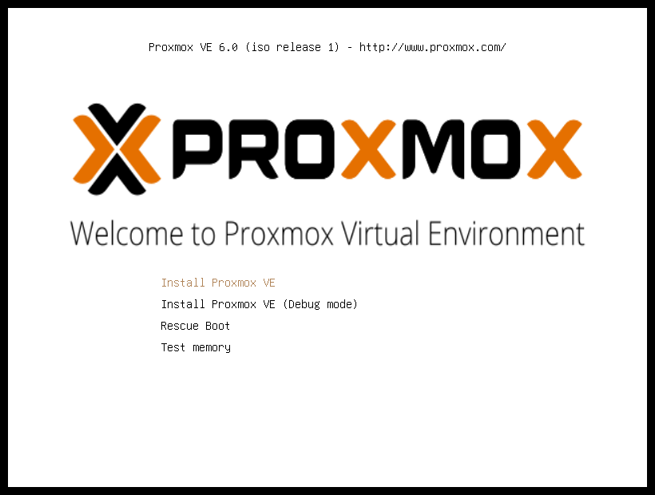
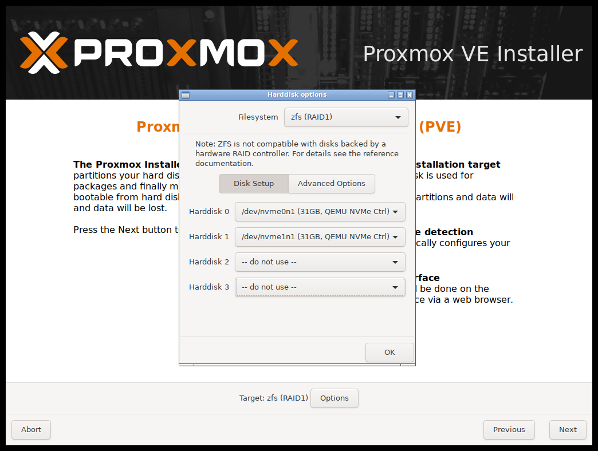
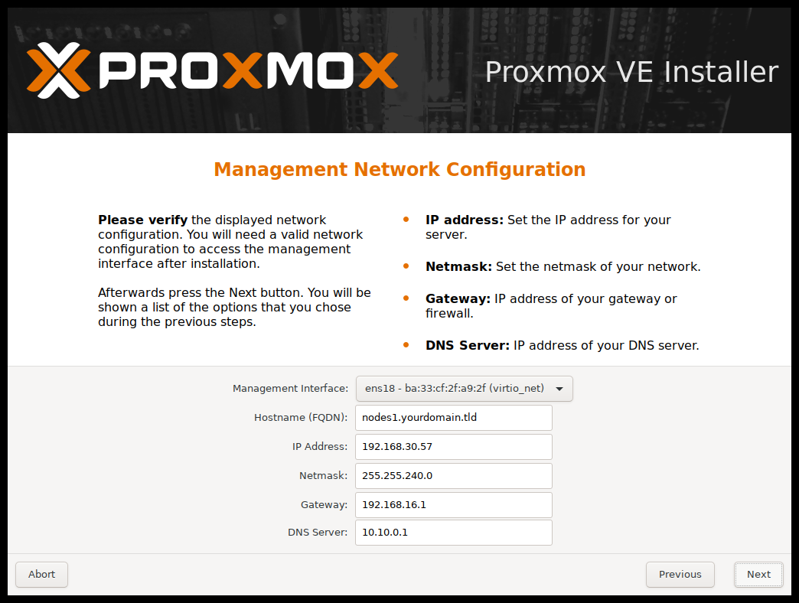

# Proxmox

Procedura installazione **Proxmox** con **RAID1 ZFS**

Nota: Proxmox non supporta [mdraid](https://pve.proxmox.com/wiki/Software_RAID) per garantire la rindondanza dei dati si consiglia l'uso di **ZFS**

## Preparazione media installazione

### Chiavetta USB

### Procedura Linux :
Dopo aver scaricato la ISO di Proxmox, scrivere con **dd** l'immagine sulla penna USB:

Se non avete permessi di scrittura, utilizzate **sudo**

Sostituire i valori if= con il percorso corretto della iso e of= con il path corretto della USB

    dd bs=1M conv=fdatasync if=./proxmox-ve_*.iso of=/dev/XYZ status=progress

### Procedura Windows

Utilizzare [BalenaEtcher](https://www.balena.io/etcher/) oppure [Rufus](https://rufus.ie/)
> Rufus non testato personalmente

## Installazione

Avviare l'installazione dal supporto creato, selezionare **"Install Proxmox VE"**

Nella schermata selezione dischi, premere il pulsante **Options** 

    Filesystem : zfs (RAID1)
    Harddisk 0: /dev/xxx
    Harddisk 1: /dev/xxx

Selezionare **Paese** / **Timezone** / **Keyboard Layout** secondo preferenze

## Impostazioni di Rete

Selezionare l'interfaccia di rete utilizzata per la gestione dell'HV

    Hostname FQDN: pve.dominio.lan
    IP: 192.168.x.x
    Netmask: 255.255.255.0
    GW: 192.168.x.x
    DNS Server: 192.168.x.x

### Impostazione Password ed indirizzo mail

    Password : Nethesis,1234
    Confirm : Nethesis,1234
    email : email@valida.com

Nota: Proxmox di default reindirizza le email di sistema all'account specificato sopra 

### Verifica parametri

Verificare nel sommario che tutte le impostazioni di siano corrette e premere il pulsante **Install**

# Login WebGUI

E' possibile accedere alla WebUI per la configurazione dell'hypervisor utilizzando un qualsiasi browser e collegandosi all'indirizzo https://ipmgmt:8006 (sostituire IP con l'indirizzo IP assegnato alla MGMT Interface)

Effettuare l'accesso come **root** utilizzando la password impostata precedentemente, nel nostro caso **Nethesis,1234**

    username: root
    password: Nethesis,1234

> Nota: è possibile accedere alla macchina anche via SSH

    dav@davidef ~ >> ssh root@192.168.5.29
    Linux pve 5.3.10-1-pve #1 SMP PVE 5.3.10-1 (Thu, 14 Nov 2019 10:43:13 +0100) x86_64

# Attivazione ?

Dovremmo attivare la macchina, ottenendo una licenza ecc ecc... altrimenti non avremmo accesso ai repo stabili... Eventualmente se vogliamo usare i community posso integrare con i step da effettuare per abilitare i repo community.

>PVE > Subscription > Upload Key

## Aggiornamento Proxmox

Dopo aver attivato la licenza di Proxmox, aggiornare il sistema:

>PVE > Updates > Refresh > Upgrade

Verrà aperta una shell, sulla quale è necessario immettere Y per procedere all'aggiornamento

>In alternativa da terminale :

    # apt-get update
    # apt-get dist-upgrade

# Caricare ISO NethServer

Carichiamo la ISO di NethServer all'interno di Proxmox

>PVE > local (pve) > Content

Facciamo click su **Upload**

Facciamo click su **Select File...** e cerchiamo il file ISO precedentemente Scaricato

 

Una volta completato l'upload, sarà visibile sulla tab **content** del local storage

# Creazione VM

E' possbile utilizzare la WebUI per la creazione della VM

Fare clik su **Create VM** in alto a destra ed inserire i parametri nella schermata e fare clic su **Next** a fondo schermata

    Inserire VM ID: 200
    Inserire Name: vm-nethservice

Selezioniamo il file **ISO** precedentemente caricato e facciamo click su **Next**

Mettiamo il segno di spunta su : **Qemu Agent**

Verifichiamo che **Disk size (GiB)** sia della grandezza da noi richiesta e controlliamo impostiamo seguenti parametri :

    Storage: local-zfs
    Cache: Write back
    Discard [V]

Assegnamo come minimo 4 core alla macchina

Assegnamo almeno 4GB di RAM alla VM

    Memory (MiB): 4096

Rimuoviamo il segno di spunta da

    Firewall [ ]

Verifichiamo che tutti i parametri siano corretti nella sommario finale, **spuntiamo la flag**

    [V] Start after created

e facciamo click su **Finish**

# Installazione NethService sulla VM

Apriamo la console della VM e Procediamo all'installazione Standard di NethServer [Link alla Guida](https://nethserver.docs.nethesis.it/it/v7/installation.html)

# Procedura Post Installazione

Una volta terminata la normale installazione di NethServer, dobbiamo installare le **Qemu-Guest-Agent** da terminale di NethServer:

    [root@ns ~]# yum -y install qemu-guest-agent

