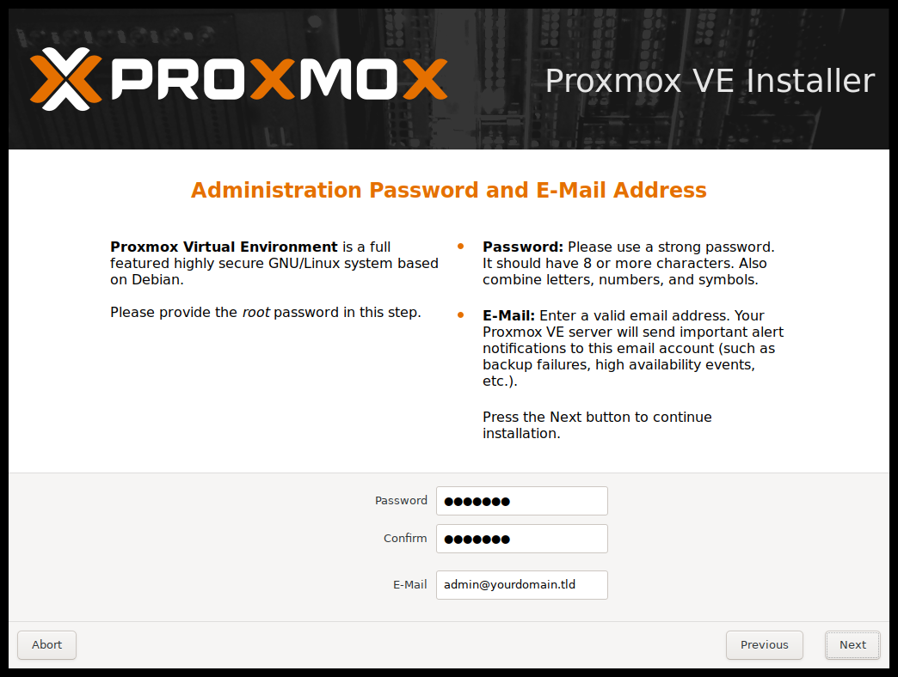
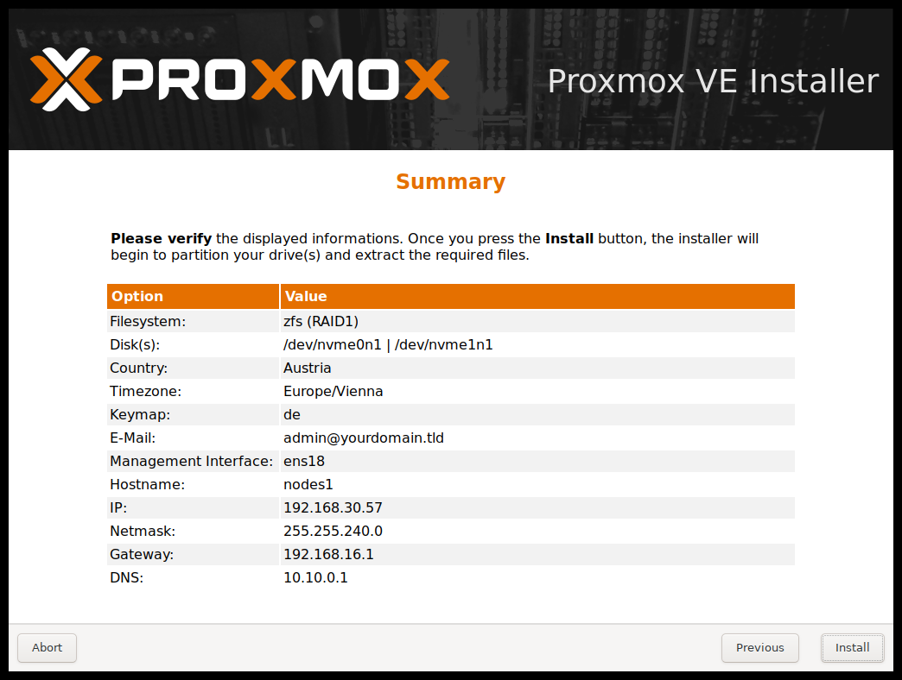
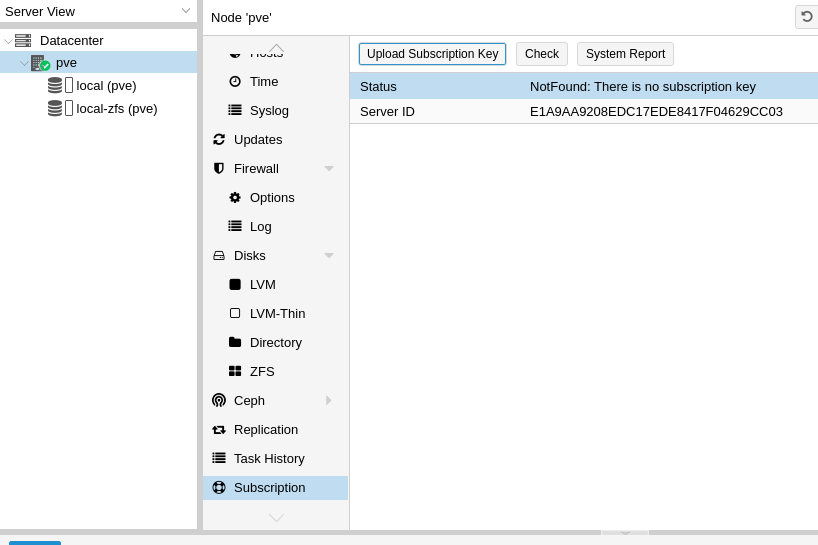

# Proxmox

Procedura installazione **Proxmox** con **RAID1 ZFS**

Nota: Proxmox non supporta [mdraid](https://pve.proxmox.com/wiki/Software_RAID) per garantire la ridondanza dei dati si consiglia l'uso di **ZFS**


## Preparazione media installazione

### Chiavetta USB

### Procedura Linux :
Dopo aver scaricato la ISO di Proxmox, scrivere con **dd** l'immagine sulla penna USB:

Se non avete permessi di scrittura, utilizzate **sudo**

Sostituire i valori if="" con il percorso corretto della iso e of="" con il path corretto della USB

```dd bs=1M conv=fdatasync if=/path/to/iso/proxmox-ve_*.iso of=/dev/XYZ```

Esempio

```
dav@davidef  ~: sudo dd bs=1M conv=fdatasync if=/home/dav/Scaricati/proxmox-ve_6.1-1.iso of=/dev/sdb
776+1 record dentro
776+1 record fuori
813922304 bytes (814 MB, 776 MiB) copied, 318,393 s, 2,6 MB/s
```

### Procedura Windows

Utilizzare [BalenaEtcher](https://www.balena.io/etcher/)


## Installazione

Avviare l'installazione dal supporto creato, selezionare **"Install Proxmox VE"**


Nella schermata selezione dischi, premere il pulsante **Options** 


```
Filesystem : zfs (RAID1)
Harddisk 0: /dev/xxx
Harddisk 1: /dev/xxx
```

Selezionare **Paese** / **Timezone** / **Keyboard Layout** secondo preferenze


## Impostazioni di Rete

Selezionare l'interfaccia di rete utilizzata per la gestione dell'HV

```
Hostname FQDN: pve.dominio.lan
IP: 192.168.x.x
Netmask: 255.255.255.0
GW: 192.168.x.x
DNS Server: 192.168.x.x
```


### Impostazione Password ed indirizzo mail

```
Password : Nethesis,1234
Confirm : Nethesis,1234
email : email@valida.com
```

Nota: Proxmox di default reindirizza le email di sistema all'account specificato sopra 


### Verifica parametri

Verificare nel sommario che tutte le impostazioni di siano corrette e premere il pulsante **Install**



# Login WebGUI

E' possibile accedere alla WebUI per la configurazione dell'hypervisor utilizzando un qualsiasi browser e collegandosi all'indirizzo https://ipmgmt:8006 (sostituire IP con l'indirizzo IP assegnato alla MGMT Interface)

Effettuare l'accesso come **root** utilizzando la password impostata precedentemente, nel nostro caso **Nethesis,1234**

```
username: root
password: Nethesis,1234
```


> Nota: è possibile accedere alla macchina anche via SSH

```
dav@davidef ~ >> ssh root@192.168.5.29
Linux pve 5.3.10-1-pve #1 SMP PVE 5.3.10-1 (Thu, 14 Nov 2019 10:43:13 +0100) x86_64
```

## Notifiche e-mail ZFS

E' disponibile un daemon che monitora gli eventi generati dal modulo kernel ZFS, possiamo utilizzarlo per inoltrare tutti gli alert generati su un indirizzo email.
Sulle nuove installazioni dovrebbe essere abilitato di default, ma è sempre bene verificare che sia così:

```
root@pve:~# apt list --installed |grep zfs-zed

WARNING: apt does not have a stable CLI interface. Use with caution in scripts.

zfs-zed/stable,now 0.8.3-pve1 amd64 [installed]
```
Verifichiamo inoltre che il file di configurazione sia correttamente settato per l'inoltro delle notifiche all'utente root, che di **default** sulle installazioni di proxmox vengono inoltrate all'indirizzo **email** specificato in fase di installazione :

```
root@pve:~# cat /etc/zfs/zed.d/zed.rc |grep root
# This file should be owned by root and permissioned 0600.
ZED_EMAIL_ADDR="root"
```

# Attivazione ?

Dovremmo attivare la macchina, ottenendo una licenza ecc ecc... altrimenti non avremmo accesso ai repo stabili... Eventualmente se vogliamo usare i community posso integrare con i step da effettuare per abilitare i repo community.

```PVE > Subscription > Upload Key```



## Aggiornamento Proxmox

Dopo aver attivato la licenza di Proxmox, aggiornare il sistema:

```PVE > Updates > Refresh > Upgrade```

Verrà aperta una shell, sulla quale è necessario immettere Y per procedere all'aggiornamento

In alternativa da terminale :

```
# apt-get update
# apt-get dist-upgrade
```


In caso fosse disponibile un aggiornamento del kernel, è consigliato eseguire il riavvio dell'host, **Proxmox** ci avvisa con il messaggio:

```
Seems you installed a new kernel update - Please consider rebooting this node to activate the new kernel.
```
Possiamo riavviare via interfaccia grafica di **Proxmox**

 ``` pve > Summary > Reboot > Yes ```
 
 Oppure da terminale con :

```root@pve:~# reboot ```

# Cluster

## Installazione secondo nodo

Procedere con l'installazione del secondo nodo ed effettuare il join al cluster.

La guida è disponibile [Qui](join-cluster.md)