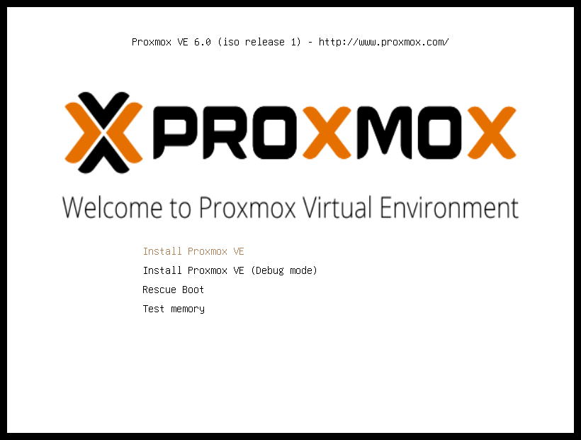
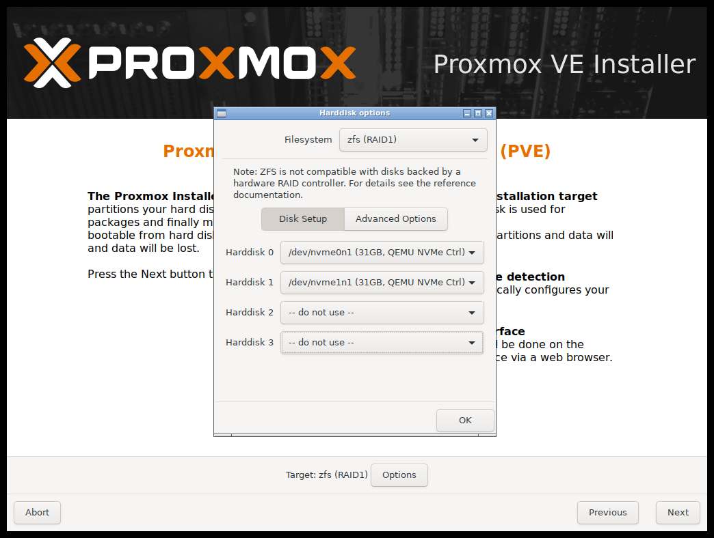
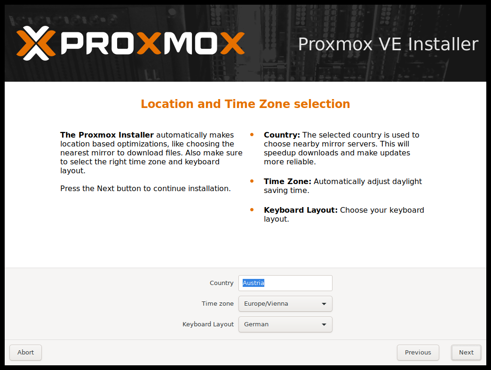
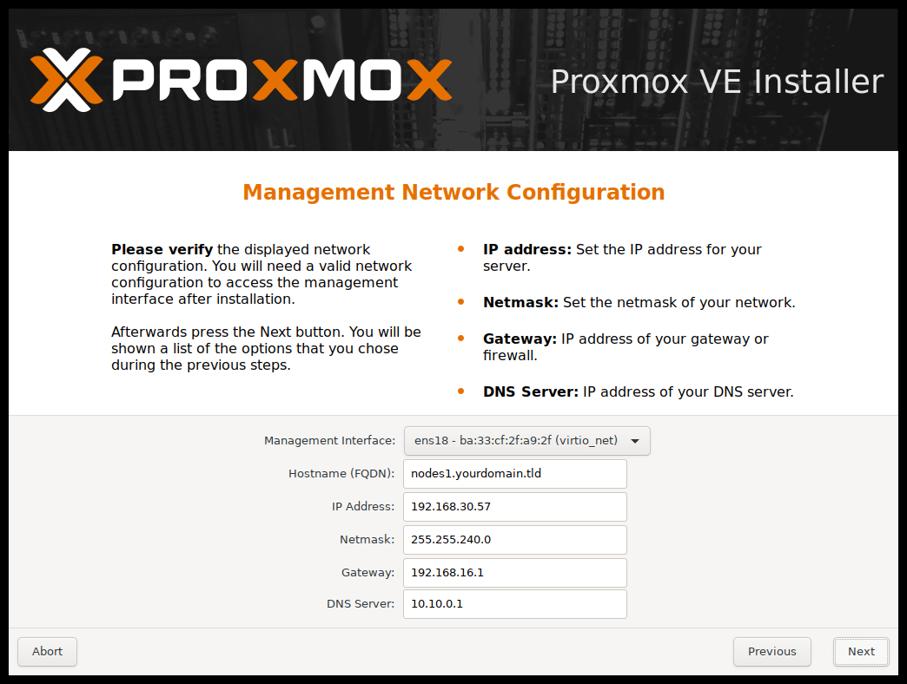
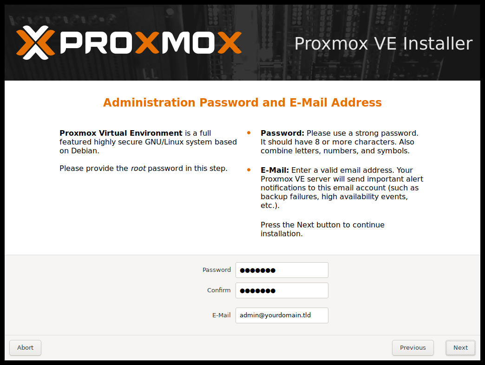
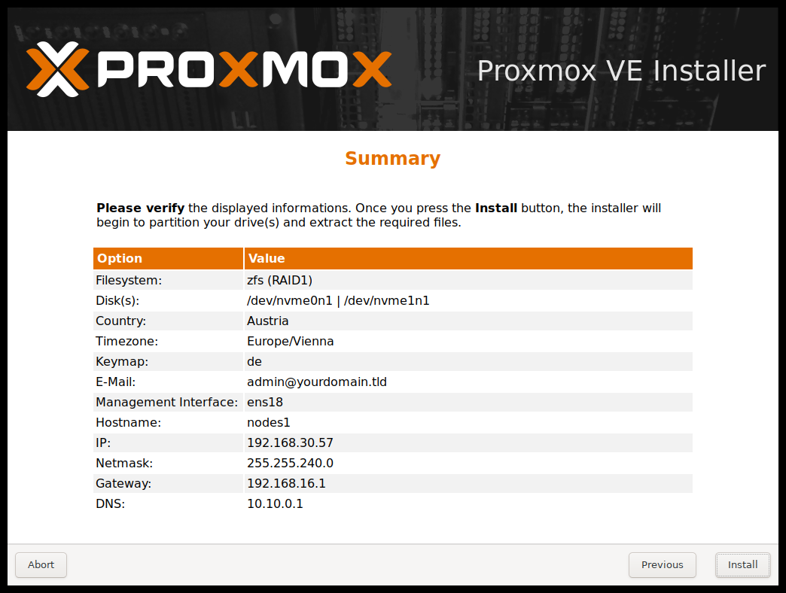
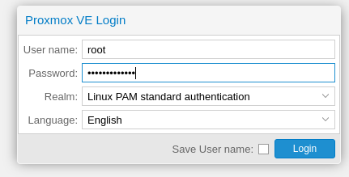

# Proxmox

Procedura installazione **Proxmox** con **RAID1 ZFS**

Nota: Proxmox non supporta [mdraid](https://pve.proxmox.com/wiki/Software_RAID) per garantire la rindondanza dei dati si consiglia l'uso di **ZFS**

## Preparazione media installazione

### Chiavetta USB

### Procedura Linux :
Dopo aver scaricato la ISO di Proxmox, scrivere con **dd** l'immagine sulla penna USB:

Se non avete permessi di scrittura, utilizzate **sudo**

Sostituire i valori if= con il percorso corretto della iso e of= con il path corretto della USB

    dd bs=1M conv=fdatasync if=./proxmox-ve_*.iso of=/dev/XYZ

### Procedura Windows

Potete utilizzare [BalenaEtcher](https://www.balena.io/etcher/) oppure [Rufus](https://rufus.ie/) ( rufus da testare non l'ho provato)

## Installazione

Avviare l'installazione dal supporto creato, selezionare **"Install Proxmox VE"**

Nella schermata selezione dischi, premere il pulsante **Options** 

    Filesystem : zfs (RAID1)
    Harddisk 0: /dev/xxx
    Harddisk 1: /dev/xxx

Selezionare **Paese** / **Timezone** / **Keyboard Layout** secondo preferenze

## Impostazioni di Rete

Selezionare l'interfaccia di rete utilizzata per la gestione dell'HV

    Hostname FQDN: pve.dominio.lan
    IP: 192.168.x.x
    Netmask: 255.255.255.0
    GW: 192.168.x.x
    DNS Server: 192.168.x.x

### Impostazione Password ed indirizzo mail

    Password : Nethesis,1234
    Confirm : Nethesis,1234
    email : email@valida.com

Nota: Proxmox di default reindirizza le email di sistema all'account specificato sopra 

### Verifica parametri

Verificare nel sommario che tutte le impostazioni di siano corrette e premere il pulsante **Install**

# Login WebGUI

E' possibile accedere alla WebUI per la configurazione dell'hypervisor utilizzando un qualsiasi browser e collegandosi all'indirizzo https://ipmgmt:8006 (sostituire IP con l'indirizzo IP assegnato alla MGMT Interface)

Effettuare l'accesso come **root** utilizzando la password impostata precedentemente, nel nostro caso **Nethesis,1234**

    username: root
    password: Nethesis,1234

Nota: è possibile accedere alla macchina anche via SSH

    dav@davidef  ~  ssh root@192.168.5.29
    Linux pve 5.3.10-1-pve #1 SMP PVE 5.3.10-1 (Thu, 14 Nov 2019 10:43:13 +0100) x86_64

