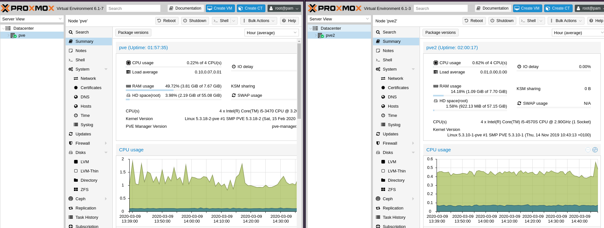
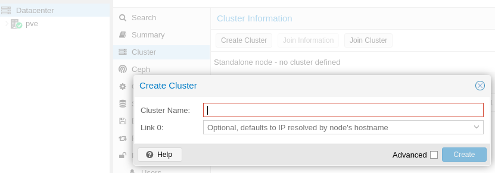
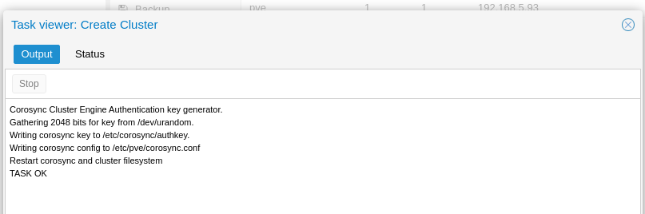
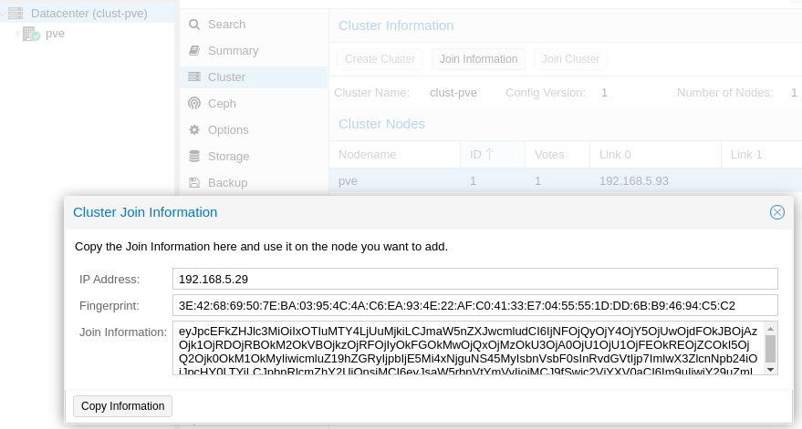
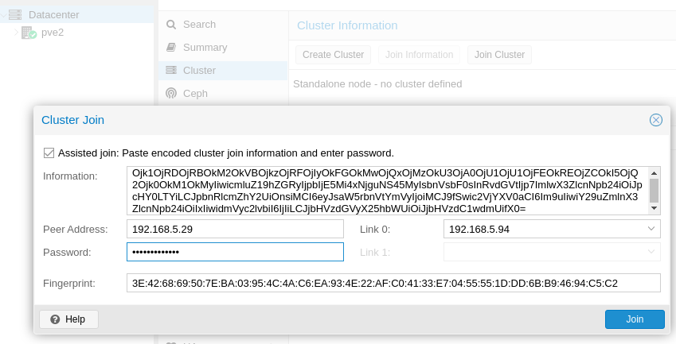
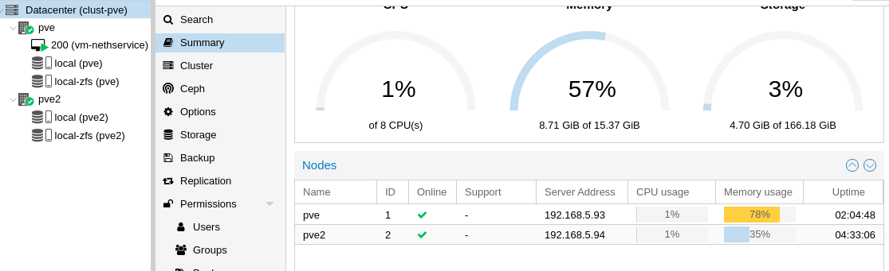

# Cluster PVE

## Aggiunta secondo Nodo

[Wiki Proxmox Cluster Manager Proxmox](https://pve.proxmox.com/wiki/Cluster_Manager)

[Wiki Proxmox Storage Replication](https://pve.proxmox.com/wiki/Storage_Replication)


Seguire la procedura di [installazione](pve-install.md), configurando di conseguenza ip e hostname fino all'aggiornamento dell'host.

Nel nostro caso avremo:

```
Macchina1: IP: 192.168.5.93 : Hostname: pve.dominio.lan
Macchina2: IP: 192.168.5.94 : Hostname: pve2.dominio.lan
```


# Molto importante!
## Non è possibile cambiare hostname o ip alle macchine (Host) una volta effettuato il join al cluster, quindi prima di eseguire le operazioni, accertarsi che gli ip e hostname assegnati siano quelli definitivi

Se modifichiamo hostname o indirizzo ip (naturalmente prima del join al cluster), ricordarsi di modificare sempre il file

```/etc/hosts```

in modo che rifletta la configurazione dell'ip e hostname; è comunque modificabile via WebGui

```pve > Hosts```

# Creazione Cluster

## Operazioni sul nodo 1 (pve)

Accedere alla WebUI del primo host e portarsi su:

```Datacenter > Cluster```



Sul primo nodo, fare click su "**Create Cluster**" immettere un "**Cluster Name**" e Selezioniamo l'interfaccia bridge su "**Link 0**":




Se la procedura è andata a buon fine, avremmo un **TASK OK**



Facciamo click su Join Information e su Copy information


## Operazioni sul nodo 2 (pve2)

Accediamo alla WebGui del secondo nodo e spostiamoci su:

```Datacenter > Cluster > Join Cluster```

Incolliamo all'interno di "**information**" il contenuto copiato in precedenza, selezioniamo l'interfaccia su "**Link 0**" ed inseriamo la password di root del secondo nodo.



Se il join al cluster è andato a buon fine vedremo sulla Dashboard entrambi i server, con il relativo status:



Ora è possibile gestire entrambi i nodi da una singola interfaccia, ed è possibile procedere all'[installazione della VM](vm-install.md)
