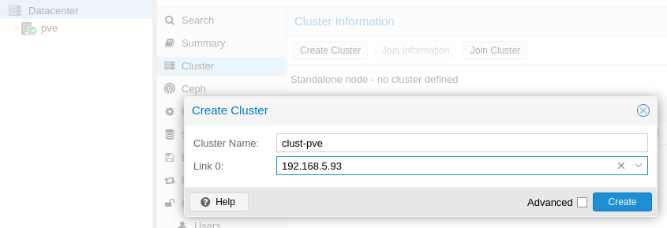
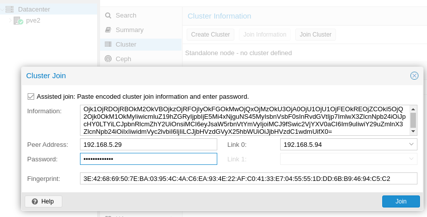

# Replica PVE

## Aggiunta secondo Nodo

[Cluster Manager Proxmox](https://pve.proxmox.com/wiki/Cluster_Manager)

[Storage Replication](https://pve.proxmox.com/wiki/Storage_Replication) Wiki Proxmox


Seguire la procedura di [installazione](install.md), configurando di conseguenza ip e hostname fino all'aggiornamento dell'host.

Nel nostro caso avremo:

```
Macchina1: IP: 192.168.5.93 : Hostname: pve.dominio.lan
Macchina2: IP: 192.168.5.94 : Hostname: pve2.dominio.lan
```


# Molto importante
## Non è possibile cambiare hostname o ip alle macchine (Host) una volta effettuato il join al cluster, quindi prima di eseguire le operazioni, accertarsi che gli ip e hostname assegnati siano quelli definitivi

## Creazione Cluster

Accedere alla WebUI del primo host e portarsi su:

```Datacenter > Cluster```


Sul primo nodo, fare click su **Create Cluster** immettere un Cluster Name e Selezionare il bridge su Link 0:




Se la procedura è andata a buon fine, avremmo un **TASK OK**


Facciamo click su Join Information e su Copy information


Spostiamoci sul secondo nodo "pve2"

Datacenter > Cluster e facciamo click su Join Cluster

Incolliamo all'interno di information il contenuto copiato in precedenza, selezioniamo l'interfaccia su Link 0 ed inseriamo la password di root del secondo nodo.

