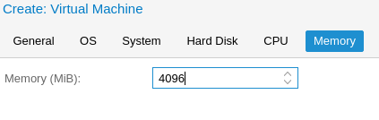

# Installazione NethServer

## Caricare ISO NethServer

Carichiamo la ISO di NethServer all'interno di Proxmox

```PVE > local (pve) > Content > Upload```


```Select File... > Selezioniamo ISO > Upload```

 

Una volta completato l'upload, sarà visibile sulla tab ```content``` del ```local storage (pve)```


# Creazione VM

E' possbile utilizzare la ***WebUI*** per la creazione della VM

Fare clik su ```Create VM``` in alto a destra ed inserire i parametri nella schermata e fare clic su ```Next``` a fondo schermata

```
Inserire VM ID: 200
Inserire Name: vm-nethservice
```


Selezioniamo il file ```ISO``` precedentemente caricato e facciamo click su ```Next``


Mettiamo il segno di spunta su : ```Qemu Agent```

```Qemu Agent: [V]```


Verifichiamo che ```Disk size (GiB)``` sia della grandezza da noi richiesta e controlliamo impostiamo seguenti parametri :

```
Storage : local-zfs
Cache   : Write back
Discard : [V]
```


Assegnamo almeno 4 core alla VM

```Cores: 4```


Assegnamo almeno 4GB di RAM alla VM

```Memory (MiB): 4096```



Rimuoviamo il segno di spunta da Firewall:

```Firewall [ ]```


Verifichiamo che tutti i parametri siano corretti nella sommario finale, ```spuntiamo la flag```

```[V] Start after created```

e facciamo click su ```Finish```


# Installazione NethService sulla VM

Apriamo la console della VM creata e procediamo all'installazione Standard di NethServer [Link alla Guida](https://nethserver.docs.nethesis.it/it/v7/installation.html)

    Nota; consiglio l'installazione in modalità Unattended, a volte l'installer interattivo da problemi nella scelta del disco.

Lato destro della schermata, espandere ```pve```, selezionare la VM ```200 (vm-nethservice)``` e fare click in alto a destra su ```>_Console```

```pve > 200 (vm-nethservice) > Console```


# Procedura Post Installazione Nethserver

## Rimozione Disco Installazione

Dopo la corretta installazione di NethServer, rimuovere la ISO dalla VM.

```pve > 200 (vm-nethservice) > Hardware > CD/DVD Drive > Edit > Do not use any media > OK```


## Installazione Guest Agent

Una volta terminata la normale installazione di NethServer, dobbiamo installare le ```Qemu-Guest-Agent``` da terminale di NethServer:

```[root@ns ~]# yum -y install qemu-guest-agent```


# Replica su secondo nodo

## Step da seguire solo se si sta realizzando un cluster

### Abilitare la replica dal primo nodo al secondo

Dal nodo primario, posizioniamoci su ```pve > Replication > Add```


Impostiamo i parametri necessari, nel nostro caso:

```
VM ID    : 200
Target   : pve2
Schedule : */2:00
Comment  : Replica VM
Enabled  : [V]
```


Finito il primo sync, se è avvenuto tutto correttamente avremo ```status OK```


## Preparazione macchina in Stand-By sul secondo nodo

La replica sul secondo nodo avviene solo a livello storage, la [wiki di Proxmox](https://pve.proxmox.com/wiki/Storage_Replication#_error_handling), raccomanda la copia dei cfg della VM sul secondo nodo solo se si verificano problemi al primo, probabilmente per evitare l'avvio della VM per sbaglio dal secondo nodo ( in caso si avviasse la macchina ci sarebbe un incongruenza dei dati).

     // da terminare o integrare dopo i test in laboratorio
     quindi ora dobbiamo preparare una macchina sul secondo nodo, in modo che sia pronta all'avvio in caso il primo nodo vada offline.

## Da verificare con test in laboratorio

Copiamo la configurazione della VM (```pve```) al nodo secondario (```pve2```)
Grazie a corosync, i file di configurazione delle VM del primo nodo dovrebbero essere comunque accessibili, anche se il nodo non risponde:

```
root@pve:cat /etc/pve/nodes/pve/qemu-server/200.conf
agent: 1
bootdisk: scsi0
cores: 4
ide2: none,media=cdrom
memory: 4096
name: vm-nethservice
net0: virtio=92:C7:17:60:3E:68,bridge=vmbr0
numa: 0
ostype: l26
scsi0: local-zfs:vm-200-disk-0,cache=writeback,discard=on,size=32G
scsihw: virtio-scsi-pci
smbios1: uuid=064fa99f-f5a3-4f95-bbea-1b8770307ea9
sockets: 1
vmgenid: e45eee04-142e-4c16-bc23-f007104194a0
```

## Log Replica

La replica avviene attraverso modifiche incrementali, il sistema genera uno snapshot e invia il delta al secondo nodo dove viene integrato con la base del primo sync, quindi dovrebbe essere abbastanza rapida.
Ovviamente maggiore è la quantità dei dati scritti tra un sync e l'altro, maggiore saranno i dati e di conseguenza il tempo impiegato.

```
2020-03-10 10:00:00 200-0: start replication job
2020-03-10 10:00:00 200-0: guest => VM 200, running => 5036
2020-03-10 10:00:00 200-0: volumes => local-zfs:vm-200-disk-0
2020-03-10 10:00:01 200-0: freeze guest filesystem
2020-03-10 10:00:01 200-0: create snapshot '__replicate_200-0_1583830800__' on local-zfs:vm-200-disk-0
2020-03-10 10:00:01 200-0: thaw guest filesystem
2020-03-10 10:00:01 200-0: incremental sync 'local-zfs:vm-200-disk-0' (__replicate_200-0_1583823600__ => __replicate_200-0_1583830800__)
2020-03-10 10:00:02 200-0: send from @__replicate_200-0_1583823600__ to rpool/data/vm-200-disk-0@__replicate_200-0_1583830800__ estimated size is 9.39M
2020-03-10 10:00:02 200-0: total estimated size is 9.39M
2020-03-10 10:00:02 200-0: rpool/data/vm-200-disk-0@__replicate_200-0_1583823600__	name	rpool/data/vm-200-disk-0@__replicate_200-0_1583823600__	-
2020-03-10 10:00:02 200-0: TIME        SENT   SNAPSHOT rpool/data/vm-200-disk-0@__replicate_200-0_1583830800__
2020-03-10 10:00:02 200-0: delete previous replication snapshot '__replicate_200-0_1583823600__' on local-zfs:vm-200-disk-0
2020-03-10 10:00:03 200-0: (remote_finalize_local_job) delete stale replication snapshot '__replicate_200-0_1583823600__' on local-zfs:vm-200-disk-0
2020-03-10 10:00:03 200-0: end replication job
```


# NON SEGUIRE
# Automatizzazione snapshot
# da decidere
# come muoversi


In questo punto bisogna valutare bene, quello che vogliamo fare... 
è possibile automatizzare gli snapshot in 2 modi, o utilizzare le api di proxmox, con cv4pve, in sostanza installiamo un container lxc, dove all'interno mettiamo questo script che non fà altro che fare richieste api all'host, e lancia la creazione ed eliminazione degli snapshot delle vm, possiamo decidere se farlo per tutte le macchine o solo per determinate vm

### o in alternativa >

usiamo sanoid, che ci consente di fare lo snapshot a livello zfs, quindi senza dover utilizzare uno script che gira all'interno del container, ma direttamente sull'host con un crontab

differenza sostanziale è che se uno lancia uno snapshot manuale quando utilizza sanoid, a volte per esperienza personale quando lo script fà il prune dei vecchi snapshot, va in confusione dato che il nome non rispetta il formato prefix-data-ora

punto a favore per sanoid è che possiamo fare lo snapshot anche dell'intero tank dove è installato l'os quindi paradossalmente potremmo ripristinare anche l'os se magari l'aggiornamento ha danneggiato qualche componente, addirittura se non fà + il boot la macchina si entra con la usb in debug, si installa zfs tools e si fa il ripristino da live env.

Da testare per quanto riguarda **sanoid** se facciamo un restore dell'intero tank, se si porta dietro anche gli snapshot della vm, ovvero io ripristino

    rpool-giorno-ora/

## lui mi tira dietro 

    rpool-giorno-ora/vm100/disco-100/

## Sanoid
Per abilitare gli snapshot automatici della VM, utilizziamo [sanoid](https://github.com/jimsalterjrs/sanoid)

> Nota : Posso fare la guida step by step per la configurazione dello script, ma magari se lo mettiamo in produzione, potremmo fare noi uno script standard che installa, copia il template e crea i file di cfg no ?

# cv4pve-autosnap

Da ricordarsi, cv4pve utilizza le api, quindi bisogna creare l'utente su proxmox, altrimenti c'è il rischio che se l'utente cambia la password di root, non abbiamo più accesso alle API

```
root@debian:~# cv4pve-autosnap --host=192.168.0.100 --username=root@pam --password=fagiano --vmid=111 clean --label='4hours' --keep=2
----- VM 100 -----
Remove snapshot: auto4hours190617080002
Remove snapshot: auto4hours190617120002
Remove snapshot: auto4hours190617160002
Remove snapshot: auto4hours190617200002
```
Scarichiamo [cv4pve](https://github.com/Corsinvest/cv4pve-autosnap)