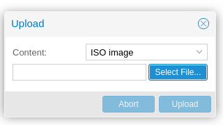
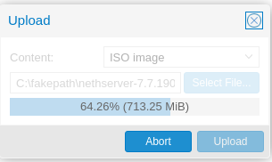
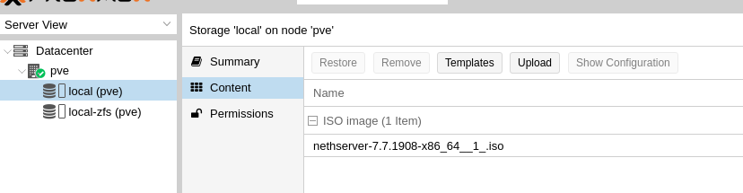
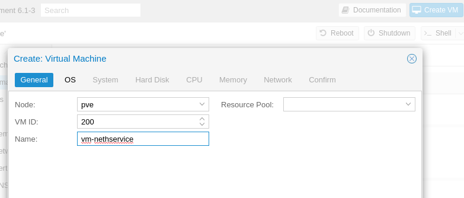
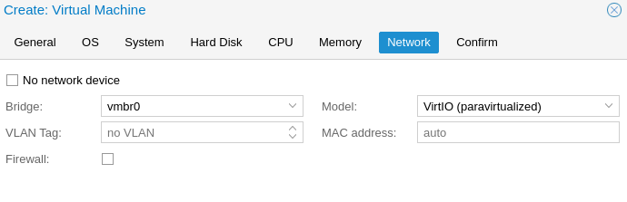
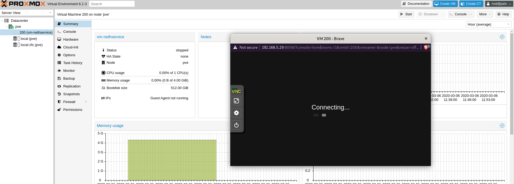

# Installazione NethServer

## Caricare ISO NethServer

Carichiamo la ISO di NethServer all'interno di Proxmox

E' possibile farlo da WebUI o da terminale:

- Terminale, entriamo via ssh, ci portiamo sulla cartella ```/var/lib/vz/template/iso``` e usiamo ```wget``` per scaricare il file iso
```
root@px01:~# cd /var/lib/vz/template/iso
root@px01:/var/lib/vz/template/iso# wget http://sito.ext/cd.iso
```

- Interfaccia Web

```PVE > local (pve) > Content > Upload```


```Select File... > Selezioniamo ISO > Upload```

 

Una volta completato l'upload, sarà visibile sulla tab ```content``` del ```local storage (pve)```



# Creazione VM

E' possbile utilizzare la ***WebUI*** per la creazione della VM

Fare clik su ```Create VM``` in alto a destra ed inserire i parametri nella schermata e fare clic su ```Next``` a fondo schermata

```
Inserire VM ID: 200
Inserire Name: vm-nethservice
```



Selezioniamo il file ```ISO``` precedentemente caricato e facciamo click su ``Next``


Mettiamo il segno di spunta su : ```Qemu Agent```

```Qemu Agent: [V]```


Verifichiamo che ```Disk size (GiB)``` sia della grandezza necessaria e impostiamo i  seguenti parametri :

```
Storage          : local-zfs
Cache            : Write back
Discard          : [V]
Disk size: (GiB) : xxx
```


Assegnamo i core necessari alla macchina, variando in base al carico di lavoro che andrà a sopportare, importante modificare il parametro `Type`, impostandolo su `Host`

``Cores: 4``

``Type: Host``


Assegnamo la quantità di RAM alla macchina (Multipli di 1024)

```Memory (MiB): 4096```


Rimuoviamo il segno di spunta da Firewall:

```Firewall [ ]```



Verifichiamo che tutti i parametri siano corretti nella sommario finale, ```spuntiamo la flag```

```[V] Start after created```

e facciamo click su ```Finish```


# Installazione NethService sulla VM

Apriamo la console della VM creata e procediamo all'installazione Standard di NethServer [Link alla Guida](https://nethserver.docs.nethesis.it/it/v7/installation.html)

    Nota; consiglio l'installazione in modalità Unattended, a volte l'installer interattivo da problemi nella scelta del disco.

Lato destro della schermata, espandere ```pve```, selezionare la VM ```200 (vm-nethservice)``` e fare click in alto a destra su ```>_Console```

```pve > 200 (vm-nethservice) > Console```




# Procedura Post Installazione Nethserver

## Rimozione Disco Installazione

Dopo la corretta installazione di NethServer, rimuovere la ISO dalla VM.

```pve > 200 (vm-nethservice) > Hardware > CD/DVD Drive > Edit > Do not use any media > OK```


## Installazione Guest Agent

Una volta terminata la normale installazione di NethServer, dobbiamo installare le ```Qemu-Guest-Agent``` da terminale di NethServer:

```[root@ns ~]# yum -y install qemu-guest-agent```


## Abilitare Replica VM sul secondo nodo (PVE2)

Possiamo ora abilitare la [replica della VM sul secondo nodo](replica-vm.md)
