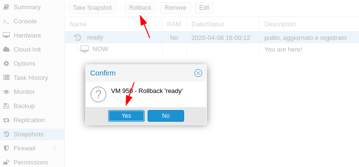
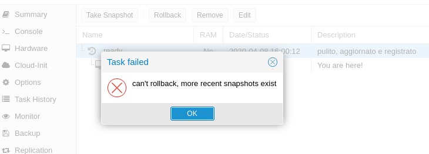

# ZFS Comandi Utili

## Verificare se tutti i pool sono funzionanti

    root@pve:~# zpool status -x
    all pools are healthy


## Verificare lo stato del pool:

    root@pve:~# zpool status
    pool: rpool
    state: ONLINE
    scan: scrub repaired 0B in 0 days 00:00:08 with 0 errors on Thu Mar  5 09:59:03 2020
    config:

        NAME                                             STATE     READ WRITE CKSUM
        rpool                                            ONLINE       0     0     0
        mirror-0                                       ONLINE       0     0     0
            ata-VBOX_HARDDISK_VBab9283d6-24a521b8-part3  ONLINE       0     0     0
            ata-VBOX_HARDDISK_VBdd1a43b5-92ab5ce0-part3  ONLINE       0     0     0

    errors: No known data errors

## Eseguire Scrub del pool (scandisk)

Per eseguire uno scrub (scandisk) sul pool di default che crea Proxmox (rpool) lanciare:

    root@pve:~# zpool scrub rpool
e sucessivamente eseguire il comando 'zpool status' per verificare lo stato dello scan

    root@pve:~# zpool status
    pool: rpool
    state: ONLINE
    scan: scrub in progress since Thu Mar  5 12:37:46 2020
        925M scanned at 231M/s, 423M issued at 106M/s, 926M total
        0B repaired, 45.74% done, 0 days 00:00:04 to go
    config:

        NAME                                             STATE     READ WRITE CKSUM
        rpool                                            ONLINE       0     0     0
        mirror-0                                       ONLINE       0     0     0
            ata-VBOX_HARDDISK_VBab9283d6-24a521b8-part3  ONLINE       0     0     0
            ata-VBOX_HARDDISK_VBdd1a43b5-92ab5ce0-part3  ONLINE       0     0     0

    errors: No known data errors

Al termine del processo rilanciando il comando 'zpool status' avremo il resoconto alla voce scan:

    scan: scrub repaired 0B in 0 days 00:00:08 with 0 errors on Thu Mar  5 12:37:54 2020

## Lista snapshot ZFS disponibili

```
root@pve:~# zfs list -t snapshot 
NAME                                  USED  AVAIL     REFER  MOUNTPOINT
rpool/data/vm-200-disk-0@preInstall     0B      -     1.70G  -
```

## Rollback snapshot

Se si tenta di ripristinare uno snapshot precentemente creato da interfaccia grafica di proxmox, comprare un errore `can't rollback more recent snapshot exist`

Se abbiamo attivato gli snapshot automatici temporizzati di zfs, da GUI di Proxmox, non possiamo ripristinare ad una versione precedente.




Per eseguire il rollback ad uno snapshot precedentemente creato, verificare gli snapshot disponibili con il comando `zfs list -t snapshot` e sucessivamente ripristinarlo con il comando `zfs rollback path/tank/vm-id-disk.0@nomesnap`

### Attenzione!

> eseguendo un rollback di uno snapshot, gli snapshot intermedi verranno PERSI! ad esempio se ripristino uno snapshot di 5 giorni fà, gli snapshot di ieri saranno irrecuperabili

```
root@px01:~# zfs rollback ZFS-SAS/VHD/vm-950-disk-0@ready 
cannot rollback to 'ZFS-SAS/VHD/vm-950-disk-0@ready': more recent snapshots or bookmarks exist
use '-r' to force deletion of the following snapshots and bookmarks:
ZFS-SAS/VHD/vm-950-disk-0@autosnap_2020-04-09_00:00:02_daily
```

ZFS ci avvisa che esistono snapshot più recenti a quello che vogliamo ripristinare, forzando con l'opzione -r elimineremo tutti gli snapshot intermedi (la vm non deve essere in esecuzione)

```
root@px01:~# zfs rollback -r ZFS-SAS/VHD/vm-950-disk-0@ready 
root@px01:~# 
```

Il rollback, se non presenta messaggi di errore è stato completato correttamente.


# ZFS Troubleshooting

## Problemi Noti ZFS

### Il sistema non si avvia e mostra un cursore lampeggiante
Potrebbe verificarsi


Symptoms: stuck at boot with an blinking prompt.
Reason: If you ZFS raid it could happen that your mainboard does not initial all your disks correctly and Grub will wait for all RAID disk members - and fails. It can happen with more than 2 disks in ZFS RAID configuration - we saw this on some boards with ZFS RAID-0/RAID-10
Boot fails and goes into busybox
If booting fails with something like

No pool imported. Manually import the root pool
at the command prompt and then exit.
Hint: try: zpool import -R /rpool -N rpool
is because zfs is invoked too soon (it has happen sometime when connecting a SSD for future ZIL configuration). To prevent it there have been some suggestions in the forum. Try to boot following the suggestions of busybox or searching the forum, and try ONE of the following:

a) edit /etc/default/grub and add "rootdelay=10" at GRUB_CMDLINE_LINUX_DEFAULT (i.e. GRUB_CMDLINE_LINUX_DEFAULT="rootdelay=10 quiet") and then issue a # update-grub

b) edit /etc/default/zfs, set ZFS_INITRD_PRE_MOUNTROOT_SLEEP='4', and then issue a "update-initramfs -k 4.2.6-1-pve -u"